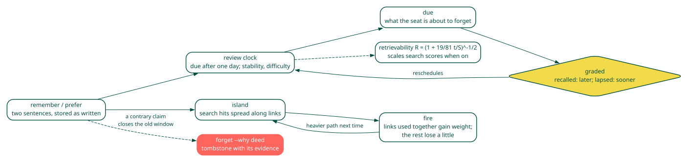

===========
Explanation
===========

A pack is not a transcript
--------------------------

Most memory layers for agents mine a transcript for facts and index what
they find. The pack refuses that path. Nothing is extracted on write. A
claim exists because a person or a seat wrote it, in two sentences at most,
and said what kind of claim it is. Text that was merely read never becomes
text that is remembered. A seat has to say what it learned, and in return
every claim has an author, a time, and a window of truth. A wrong claim is
closed or retracted with the deed that showed it wrong.

What a search ranks
-------------------

Two lexical ballots always run: a prefix-and-one-edit scan that finds a
claim through a typo, and BM25+ over an inverted index that weighs a word by
how much it narrows the pack. A dense ballot runs when an encoder is
present. The panel fuses the ballots by CombMNZ and diversifies by maximal marginal
relevance (MMR).
Each default was measured on LoCoMo (https://doi.org/10.48550/arXiv.2402.17753), 1986
questions over ten conversations with labelled evidence turns, loaded as
atoms so the scorer is what is measured:

.. table::

    +--------------------------------------+-------+-------+
    | Arm                                  | hit@1 | hit@5 |
    +======================================+=======+=======+
    | BM25, turns                          | 0.615 | 0.716 |
    +--------------------------------------+-------+-------+
    | BM25+, turns                         | 0.635 | 0.732 |
    +--------------------------------------+-------+-------+
    | BM25+, passage windows of six turns  | 0.668 | 0.771 |
    +--------------------------------------+-------+-------+
    | passage BM25+ fused with e5-large-v2 | 0.736 | 0.812 |
    +--------------------------------------+-------+-------+
    | published lexical plus dense system  | 0.752 | 0.829 |
    +--------------------------------------+-------+-------+

Dirichlet language-model scoring lost to BM25+. SPLADE++ alone scored
0.637 and fused to 0.714, level with the dense ballot. A cross-encoder
second stage did not beat the free fusion and is off by default. The
diversify slot made no difference to recall, which is the wrong benchmark
for it: a diversifier is for not answering the same claim four ways, and
LoCoMo has nothing to suppress. The full table with every arm is in the
repository README.

On LongMemEval\_S (https://doi.org/10.48550/arXiv.2410.10813), 470 answerable questions
over about fifty sessions each, BM25+ alone reaches 0.91 recall@5 at session
granularity under all three document protocols, and 0.86 hit@1. Preference
questions are the weak type at 0.30 to 0.47 hit@1; the dense arm is the
next measurement there.

Forgetting is a feature
-----------------------

A claim that is never used should not weigh as much as one that is. The
pack gives every claim a review clock modelled on spaced repetition: a
stability in days, a difficulty, and a due date. Grading a review recalled
grows stability by how overdue the claim was; lapsed halves it. This is
the update rule the Free Spaced Repetition Scheduler (FSRS) fits to millions
of reviews
(https://doi.org/10.1145/3534678.3539081), and the retrievability it implies,
``R = (1 + 19/81 * t/S)^(-1/2)``, is a power law of the kind Wixted and
Ebbesen found for human forgetting (https://doi.org/10.1111/j.1467-9280.1991.tb00175.x)
and Anderson and Schooler traced to the statistics of the environment
(https://doi.org/10.1111/j.1467-9280.1991.tb00174.x). The spacing effect the clock
schedules for is the best replicated result in the memory literature
(Cepeda et al., https://doi.org/10.1037/0033-2909.132.3.354); Ebbinghaus's own curve
replicates (https://doi.org/10.1371/journal.pone.0120644).

Two consequences. ``due`` lists what a seat is about to forget, and a
sitting starts by reading and grading it. With ``PACKSET_DECAY=fsrs`` the
same ``R`` scales a search score, so an unreviewed claim sinks without
vanishing: it floors at a quarter of its weight, and a claim nothing else
answers is still found. Trust rows and cards are exempt; they are weighed,
not recalled. LoCoMo and LongMemEval carry no review history, so the slot cannot be
measured there. A synthetic longitudinal corpus can
(``examples/forgetting.rs``): 300 topics, one claim per topic written in the
first thirty days and recalled whenever its clock came due, three
paraphrases of it written after day 150 and never reviewed, the topic
asked on day 180. The paraphrases share every word with the kept claim.

.. table::

    +-----------------------------------+------------------+-----------------------------+
    | decay slot                        | kept claim first | mean rank of the kept claim |
    +===================================+==================+=============================+
    | off, lexical only                 |            0.230 |                        2.49 |
    +-----------------------------------+------------------+-----------------------------+
    | on, fourteen-day half-life on age |            0.270 |                        3.74 |
    +-----------------------------------+------------------+-----------------------------+
    | fsrs, retrievability              |            0.947 |                        1.05 |
    +-----------------------------------+------------------+-----------------------------+

Lexical scoring cannot tell the four apart, so it lands at chance. Recency
prefers the paraphrase written last week. Retrievability prefers the claim
the seat kept using, and loses only where a paraphrase written in the last
day or two carries more retrievability than a kept claim thirty days past
its last review. The slot stays off by default until a seat has a review
history worth reading.

Islands
-------

Every claim links to the claims it shares names with, at most eight,
chosen by relative-neighbourhood pruning so a neighbourhood spreads over
the directions a claim is about instead of piling into one. That graph has
natural clusters. ``packset islands`` lists them by label propagation
(https://doi.org/10.1103/PhysRevE.76.036106), and ``packset island CUE`` finds the one a
task activates: the top five search hits seed a spread, half the
activation crosses each hop divided by fan-out, two hops, strongest first.
The construction is spreading activation over a semantic network (Collins
and Loftus, https://doi.org/10.1037/0033-295X.82.6.407). An island is not a set or a
persona: a set is a slice a person pinned, a persona colours everything,
an island is what one piece of work touches, found from the work itself.

Use shapes the graph. A link carries a weight, 0.5 until something fires
over it. When the seat uses an island, the claims in it fired together:
each pair's weight moves a tenth of the way to one, a pair with no link
gains one, and every other link of a fired claim loses two percent. That is
Hebb's rule with the forgetting term Oja added so weights stay bounded
(https://doi.org/10.1007/BF00275687). Activation spreads in proportion to weight, so
the paths a seat walks carry more each time and the ones it never walks
fade toward nothing without being deleted. Weights sit beside the links on
the atom and travel in a handover.

One writer
----------

The store is one Lightning Memory-Mapped Database (LMDB) file and one
process owns it. Two writers on one
file is how a pack ends up with two answers to one question, so a second
``packsetd`` refuses to start. Readers share one parsed snapshot per write,
and a search runs over an index built once per generation, which is why a
query over ten thousand atoms costs about two milliseconds.

Trust is memory too
-------------------

A ``trust`` atom is one weighted edge of an influence graph: who listens to
whom, and how much. It carries the same validity window and supersession
as any claim, cites the deeds behind it, and travels in a handover. The
seat reads the live rows into a DeGroot or Friedkin-Johnsen settle, and
reweighs voters by what turned out right. The pack stores the rows; it
settles nothing.

Where the stack joins
---------------------

A claim may cite a deed accession. The deed store owns the bytes and the
proof; the tracker cites the same accession on a node. ``accessions`` and
``citers`` are the two directions of that join, and neither store opens the
other. The seat, ``ljos``, composes them.
